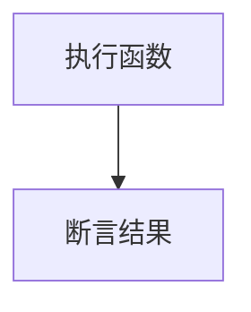

#  vitest 用法概览
## 测试文件结构
写单元测试从结构上来说主要分两部分，test Suite（describe） 和 test case(it)。简单理解 suite 类比前端的模块 module，case 类比前端的函数 function
``` javascript
import { describe, it } from 'vitest'
describe('util 模块', () => {
  it('request 方法', async () => {
    /* ... */
  })
})
```
## 测试流程

我们在演示一个 demo 之前，先记住两句话，测试就两步，**执行代码，断言结果**



## 测试演示
首先，我们编写两个函数，功能就是小数向下取整和向上取整
```ts
export const floor = (value: number) => {
  return Math.floor(value)
}
export const ceil = (value: number) => {
  return Math.ceil(value)
}

```
如果我们要对 floor 函数进行测试，要如何测试？
```ts
import { floor } from "../util"

describe('测试 util ', () => {
  it('test floor ', () => {
    expect(floor(3.25)).toBe(3)
  })
})
```


describe 表示一组用例分组，其中 it 用于定义单个的用例，其中可以包含多组 it，it也可以写成 test，其中 **expect**(floor(3.25)).toBe(4) 这句话是最核心的，我们叫做**断言**语句，意思就是

我作为测试，先执行这行代码，```floor(3.25)```（执行代码）

如果等于4，则用例**通过**，不等于4，则**不通过**（断言结果）

因为 vitest 内置 [Chai](https://www.chaijs.com/) 进行断言和与 [Jest expect](https://jestjs.io/docs/expect) 兼容的 APIs,所以断言风格会比较多样，所以建议统一使用 describe 和 it .

成功


失败的话，会出现日志


如果用例失败报错了，想临时跳过运行某些测试，但又不想删代码，可以使用 `test.skip` 或者`test.todo`来跳过这些测试。
```ts
  it.todo('test skip ', () => {
    expect(floor(3.25)).toBe(100)
  })
  it.skip('test todo ', () => {
    expect(ceil(3.25)).toBe(100)
  })
```


## 如何优雅的划分 cases


* 一个功能放到一个 it 包裹的代码块里面,功能相互独立。一一对应。
* case 里面的每一行 expect 可以有依赖关系，也可以没有依赖关系，有依赖关系的放前面，当前面的测试用例报错了，后续的 case 也会中断不执行
* 边界情况放到单独的 it 代码块，单独处理


我们再来用一个复杂点的 case ，来加深印象

```ts
// 模拟的前端组件
class MyComponent {
  data: number[]
  constructor() {
    this.data = []
  }

  fetchData() {
    // 模拟异步数据获取
    return new Promise((resolve) => {
      setTimeout(() => {
        this.data = [1, 2, 3]
        resolve('success')
      }, 1000)
    })
  }
}

describe('测试  component', () => {
  test('fetchData 方法应正确获取数据', async () => {
    const component1 = new MyComponent()
    await component.fetchData()
    // 断言数据是否符合预期
    expect(component.data).toEqual([1, 2, 3, 4])
  })

  test('data 数组应为空数组', () => {
    // 断言数据是否为空数组
    const component2 = new MyComponent()
    expect(component.data).toEqual([])
  })
})

```
上面例子会发现。每一个测试case之前，都要重新 new 一个新的 MyComponent，目的是为了生成一个新的实例对象，例如component1、component1，这样才不会互相影响,但这样的重复处理有更好的方式.

## 勾子函数
下面我来介绍一下勾子，类似 vue 的生命周期
* ```beforeAll``` 注册一个回调函数，在开始运行当前上下文中的所有测试之前调用一次。 如果函数返回一个 Promise ，Vitest 会等待承诺解析后再运行测试。

* ```beforeEach``` 注册一个回调函数，在当前上下文中的每个测试运行前调用。 如果函数返回一个 Promise ，Vitest 会等待承诺解析后再运行测试。
* ```afterEach``` 注册一个回调函数，在当前上下文中的每个测试完成后调用。 如果函数返回一个承诺，Vitest 会等待承诺解析后再继续。
* ```aftereAll``` 注册一个回调函数，以便在当前上下文中所有测试运行完毕后调用一次。 如果函数返回一个 Promise ，Vitest 会等待承诺解析后再继续。

例如，刚刚上面的例子就可以改造成如下
```ts
describe('测试  component', () => {
  let component:MyComponent

  // 在每个测试之前执行的准备工作
  beforeEach(() => {
    // 创建一个新的组件实例
    component = new MyComponent()
  })
  test('fetchData 方法应正确获取数据', async () => {
    await component.fetchData()
    // 断言数据是否符合预期
    expect(component.data).toEqual([1, 2, 3, 4])
  })

  test('data 数组应为空数组', () => {
    // 断言数据是否为空数组
    expect(component.data).toEqual([])
  })
})
```
其实上面的例子，就是一个我们业务中平时编写一个最简单的单元测试全过程了，接下去无非就是学习更多的 expect 语法去测试更多的场景，学习 mock 语法去减少测试的工作量，学习如何测试整个 vue 相关的生态。


接下来我们再看看，如果这几个勾子函数如果混用，它们的执行顺序是怎么样的呢，下面有一个完整的打印顺序，大家先别看答案，自己想想输出的结果是什么
```ts
beforeAll(() => console.log('Global - beforeAll'))
afterAll(() => console.log('Global - afterAll'))
beforeEach(() => console.log('Global - beforeEach'))
afterEach(() => console.log('Global - afterEach'))

describe('Scoped A', () => {
  beforeAll(() => {
    console.log('Scoped A - beforeAll')
  })
  beforeEach(() => {
    console.log('Scoped A - beforeEach')
  })
  afterAll(() => {
    console.log('Scoped A - afterAll')
  })
  afterEach(() => {
    console.log('Scoped A - afterEach')
  })
  it('Scoped A case 1', () => {
    console.log('Scoped A case 1')
  })
  it('Scoped A case 2', () => {
    console.log('Scoped A case 2')
  })
})
describe('Scoped B', () => {
  beforeAll(() => {
    console.log('Scoped B - beforeAll')
  })
  beforeEach(() => {
    console.log('Scoped B - beforeEach')
  })
  afterAll(() => {
    console.log('Scoped B - afterAll')
  })
  afterEach(() => {
    console.log('Scoped B - afterEach')
  })
  it('Scoped B case 1', () => {
    console.log('Scoped B case 1')
  })
  it('Scoped B case 2', () => {
    console.log('Scoped B case 2')
  })
})


```

答案输出
```ts
Global - beforeAll
  Scoped A - beforeAll
    Global - beforeEach
    Scoped A - beforeEach
    Scoped A case 1
    Scoped A - afterEach
    Global - afterEach

    Global - beforeEach
    Scoped A - beforeEach
    Scoped A case 2
    Scoped A - afterEach
    Global - afterEach
  Scoped A - afterAll
  
  Scoped B - beforeAll
    Global - beforeEach
    Scoped B - beforeEach
    Scoped B case 1
    Scoped B - afterEach
    Global - afterEach

    Global - beforeEach
    Scoped B - beforeEach
    Scoped B case 2
    Scoped B - afterEach
    Global - afterEach
  Scoped B - afterAll
Global - afterAll

```

## 课件地址

上面的代码，都放到了 [github](https://github.com/Faithree/vue-test-book) 上，欢迎点赞收藏，我会持续更新代码和文章，消息窗口我，或者直接加我 wechat: match124

