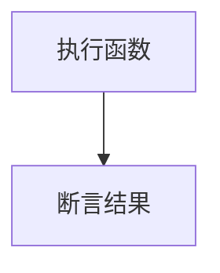
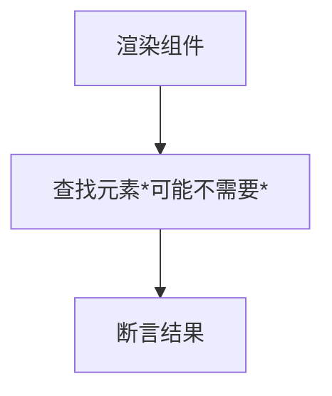

# 组件基本测试
##  前置知识
前面几章讲的都是 JS 函数的测试，接下来我们要开始测试 vue 组件了，vue 组件的测试需要依赖另一个库 @vue/test-utils,这个库我们之前装过了，如果没安装可以执行。
```bash
pnpm install --save-dev @vue/test-utils

# or
yarn add --dev @vue/test-utils
```

在学习之前，我们复习下前几节课说的测试步骤：`执行代码，断言结果`




但 vue 组件渲染不是执行一个函数，而是渲染所以要改一下，也很简单，分三步 `渲染组件，查找元素(可无), 断言结果`



## 渲染组件
一个简单的渲染 `msg` 的组件
```ts
<script setup lang="ts">
defineProps<{
  msg: string
}>()
</script>

<template>
  <div>
    <h1>{{ msg }}</h1>
  </div>
</template>

```
再来看看测试用例如何写的
```ts
import { mount } from '@vue/test-utils'
import HelloWorld from '../HelloWorld.vue'

describe('HelloWorld', () => {
  it('renders properly', () => {
    const wrapper = mount(HelloWorld, { props: { msg: 'Hello Vitest' } })
    expect(wrapper.text()).toContain('Hello Vitest')
  })
})

```
上面用例分三步理解
1. 渲染：把 HelloWorld 组件渲染出来，通过第二个参数，向渲染的组件传递 props 参数 msg 的值是 'Hello Vitest'，
2. 查询：查询整个组件内的文本
3. 断言：文本内包含 Hellow Vitest 这几个字符
如果到这一步

如果到这一步就觉得很难懂的话，我建议代码加上一行 `console.log(wrapper.html())`


看完输出之后，是不是就很好理解了

### mount 和 shallowMount 
在 Vue Test Utils 中，`mount` 和 `shallowMount` 是两个常用的方法，用于创建 Vue 组件的包裹器（Wrapper）对象，并提供对组件的访问和操作。这两个方法之间的区别在于其处理子组件的方式。

1.  `mount` 方法：

    -   `mount` 方法会创建一个完整的组件包裹器，包括渲染组件及其子组件。
    -   它适用于需要进行组件完整渲染并测试组件及其子组件之间交互的情况。
    -   `mount` 方法会触发组件的生命周期钩子函数，如 `created`、`mounted` 等，也会执行子组件的逻辑。
    -   由于会渲染所有子组件，`mount` 方法的性能相对较低，特别是在测试大型组件树时。

1.  `shallowMount` 方法：

    -   `shallowMount` 方法会创建一个浅层的组件包裹器，它只会渲染当前组件，而不会渲染其子组件。
    -   它适用于只关注当前组件的行为，并希望忽略子组件逻辑的情况。
    -   `shallowMount` 方法不会触发子组件的生命周期钩子函数，仅执行当前组件的逻辑。
    -   由于只渲染当前组件，`shallowMount` 方法的性能相对较高，特别是在测试大型组件树时。

来看个 demo 
```ts
<script setup lang="ts">
import { onMounted } from 'vue'
import SubComponent from "./SubComponent.vue"

onMounted(() => {
  console.log(`HelloWorld is now mounted.`)
})
defineProps<{
  msg: string
}>()
</script>

<template>
  <div>
    <h1>{{ msg }}</h1>
    <sub-component/>
  </div>
</template>

```

```ts
import { mount, shallowMount } from '@vue/test-utils'
import MountAndShallow from './MountAndShallow.vue'

describe('mount 和 shallowMount 区别', () => {
  it('mount', () => {
    const wrapper = mount(MountAndShallow, { props: { msg: 'Hello Vitest' } })
    console.log('wrapper.html()', wrapper.html())
  })
  it('shallow mount', () => {
    const wrapper = shallowMount(MountAndShallow, { props: { msg: 'Hello Vitest' } })
    console.log('wrapper.html()', wrapper.html())
  })
})


```
输出结果如下


在选择使用 `mount` 还是 `shallowMount` 时，取决于你的测试目标和需求。如果你的测试重点是组件及其子组件之间的交互，或需要测试完整的组件生命周期，那么使用 `mount` 是合适的。而如果你只关注当前组件的行为，而忽略子组件的逻辑，或希望提高测试性能，那么使用 `shallowMount` 是更好的选择。

## 查找元素
当我们调用 mount 和 shallow mount之后，会返回一个 wrapper，wrapper暴露了一些方法，可以让我们去查找渲染的元素或者元素的属性

查询分为 element 查询和 component 查询, 当我们渲染组件之后，如果想定位到某个元素或者子组件的范围的时候，就可以使用 `get`、`find`、`findAll` 方法拿到，类似我们 html 里面的 `querySelector、querySelectorAll`支持用元素、类、id 等查找元素
### element 查找
* `find` 查找元素，支持用元素、类、id 等查找元素，找不到返回 undefined
* `get` 查找元素，找不到会报错
* `findAll` 查找多个元素，找不到会返回空数组
```ts
<script setup lang="ts">
import Button from './Button.vue'

defineProps<{
  msg: string
}>()
</script>

<template>
  <div>
    <h1>{{ msg }}</h1>
    <h1>{{ msg }}</h1>
    <h3 data-testid="title">title</h3>
    <Button></Button>
  </div>
</template>


```
```ts
  it('查询元素，可以同过标签、属性、id、类名查找', () => {
    const wrapper = mount(Find, { props: { msg: 'Hello Vitest' } })

    const title = wrapper.find('[data-testid="title"]') // 属性查找
    expect(title.text()).toBe('title')
    // 获取第一个h1元素
    expect(wrapper.get('h1').text()).toBe('Hello Vitest')
    // 获取第一个 h1 元素
    expect(wrapper.findAll('h1').at(0)?.text()).toBe('Hello Vitest')
    // 获取第二个 h1 元素
    expect(wrapper.findAll('h1').at(1)?.text()).toBe('Hello Vitest')

    expect(wrapper.find('h2')) // 找不到返回 undefined
    // expect(wrapper.get('h2')) // 找不到会直接报错
    // console.log(wrapper.findAll('h2'))
  })
```

### component 查找
* `findComponent` 查找元素，找不到返回 undefined
* `getComponent` 查找元素，找不到会报错
* `findAll` 查找多个元素，找不到会返回空数组
```ts
  it('查询组件', () => {
    const wrapper = mount(Find, { props: { msg: 'Hello Vitest' } })
    console.log('wrapper.getComponent(Button)', wrapper.getComponent(Button).html())

    expect(wrapper.getComponent(Button).text()).toBe('default buttonif buttonshow button')
    expect(wrapper.findComponent(Button).text()).toBe('default buttonif buttonshow button')
    expect(wrapper.findAllComponents(Button).at(0)?.text()).toBe('default buttonif buttonshow button')
  })
```


## 断言元素
### 断言文本和 DOM
*  `wrapper.html()`输出 dom 结构
 * `wrapper.text()`输出文本
```ts
<script setup lang="ts">
defineProps<{
  msg: string
}>()
</script>

<template>
  <div>
    <h1>{{ msg }}</h1>
  </div>
</template>

```
如果想断言组件能否正确渲染 `Hello Vitest`

```ts
 it('mount', () => {
    const wrapper = mount(HelloWorld, { props: { msg: 'Hello Vitest' } })
    expect(wrapper.text()).toContain('Hello Vitest')
    expect(wrapper.html()).toContain('Hello Vitest')
    console.log('text ===',wrapper.text()) // Hello Vitest
    console.log('html ===',wrapper.html()) // <div> <h1>Hello Vitest</h1></div>
  })
```
实际上，凭我的经验，使用 `wrapper.html()`这一个就可以了，既用于 dom 的断言，也可以用于文字的断言
### 断言元素展示隐藏
在 vue 中，可以使用 v-if 或者 v-show 来显示隐藏 dom 节点，
* `v-if` 指令的表达式结果为真 (truthy) 时，元素会被渲染到DOM中。如果结果为假 (falsy)，元素以及其子元素将不会被渲染
* `v-show`通过切换CSS的`display`属性来控制元素的可见性。如果表达式的结果为假，元素会被隐藏（`display: none`），而不是从DOM中移除。

它们分别得使用下面的方式去断言
* `exists` 元素是否在 dom (用于 v-if)
* `isVisble` 元素在 dom上，可能不展示(用于 v-show)

```ts
<script setup lang="ts"></script>

<template>
  <div>
    <div>default button</div>
    <div v-if="false" data-testid="if">if button</div>
    <div v-show="false" data-testid="show">show button</div>
  </div>
</template>

```

```ts
  it('元素是否展示，是否可见 ', () => {
    const wrapper = mount(Button)
    const showDom = wrapper.find('[data-testid="show"]')

    const ifDom = wrapper.find('[data-testid="if"]')
    expect(showDom.isVisible()).toBeFalsy()
    expect(showDom.exists()).not.toBeFalsy()
    expect(ifDom.exists()).toBeFalsy()
  })
```

### 断言元素的属性 `attributes`
通过 find 获取了具体的 dom 节点之后，可以通过 attributes()获取到当前 dom 的属性，可以根据具体的属性做具体的断言
```ts
 it('元素的属性 ', () => {
    const wrapper = mount(Button)
    const showDom = wrapper.find('[data-testid="show"]')
    console.log('attributes',showDom.attributes())
  })
```
输出
```ts
attributes { 'data-testid': 'show', style: 'display: none;' }
```
### 断言组件的属性

通过 `wrapper.vm` 可以拿到当前组件实例的[方法和属性](https://vuejs.org/api/component-instance.html),例如 `$data`,`$props`
```ts
// 组件定义了 props 和 ref
const name = ref('customer-ref')

defineProps<{
  msg: string
}>()
```
```ts
  it('组件的属性 ', () => {
    const wrapper = mount(Find, { props: { msg: 'Hello Vitest' } })
    console.log(wrapper.vm)
    console.log(wrapper.vm.$props)
    console.log(wrapper.vm.$props)
    console.log(wrapper.vm.name)
  })
```
直接输出 wrapper.vm 输出的是一个空对象，不要以为真的拿不到值，其实输出 wrapper.vm.$props 是有东西的
最后输出结果


## 课件地址

上面的代码，都放到了 [github](https://github.com/Faithree/vue-test-book) 上，欢迎点赞收藏，我会持续更新代码和文章，消息窗口我，或者直接加我 wechat: match124
